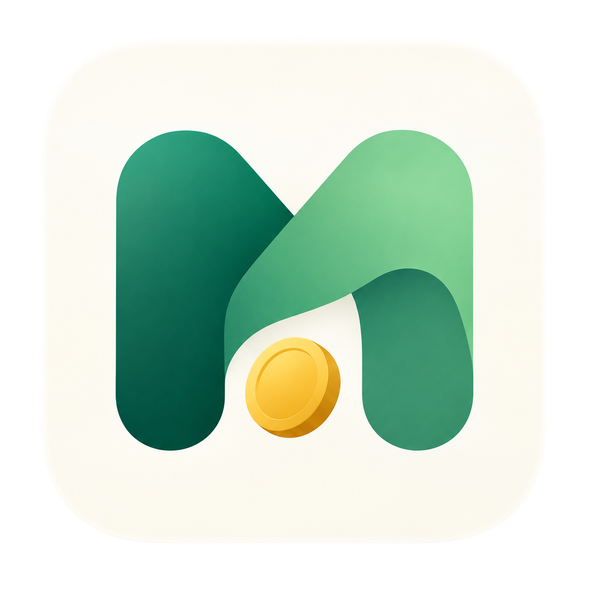

<p align="center">
  
</p>

<h1 align="center">Monee</h1>

<p align="center"><strong>Know Your Money. Own Your Future.</strong></p>

Monee 是一款正在设计中的个人财务助手，目标是自动整理账单、解释财务变化，只在需要判断时提醒你。

## 产品方向

- **自动归集**：优先接收指定文件夹和邮件附件中的账单，必要时补充手动导入。
- **可信账本**：统一支付宝、微信、银行卡与京东白条流水，处理重复交易、退款和信用账户还款。
- **主动分析**：解释月度变化，提示疑似固定支出变化，集中展示需要核实的事项。
- **本地优先**：Web 与 Mac App 共用本地数据，为后续云端同步保留兼容性。
- **四端规划**：客户端使用 KMP + Compose Multiplatform，先支持 Web / Mac，随后补齐 iOS / Android；服务端使用 Golang。

## 项目状态

客户端技术栈已确定为 **KMP + Compose Multiplatform**。仓库已建立共享 UI 的 Web / Mac 体验预览，可以切换月份、搜索中文账单并查看详情。

预览仅使用合成数据，不读取个人文件、不保存账单，也尚未接入 Go / SQLite。正式导入、记账、邮件接收与云端同步仍在设计和实施阶段。Android / iOS 入口后续补齐。

## 运行体验预览

需要 JDK 17，首次构建需要联网下载 Gradle 和 Kotlin/Compose 依赖。

```sh
# Mac 桌面窗口
./gradlew :desktopApp:run

# 浏览器预览，访问任务输出的本地地址
./gradlew :webApp:wasmJsBrowserDevelopmentRun

# 共享展示逻辑检查、桌面编译、Web 构建
./gradlew :shared:jvmTest :desktopApp:classes :webApp:wasmJsBrowserDistribution
```

Web 需要支持 WebAssembly GC 的现代浏览器。完整中文字体随应用资源提供；首次 Web 加载体积仍需进一步优化。Web 中文搜索已验证，Mac 键盘输入尚待实际输入法复验。

共享界面位于 `shared/src/commonMain`，平台入口为 `desktopApp` 和 `webApp`。技术边界和验证结果见 [KMP 体验验证](docs/architecture/kmp-validation.md)。

## 文档与品牌资源

- [品牌说明](docs/brand.md)：Logo 原图、Slogan 与使用约定。
- [Logo 原图](assets/brand/logo.png)：1254 × 1254 PNG。
- [应用图标](assets/brand/app-icon.png)：透明边缘派生图，供页面和 Mac 打包使用。
- [MVP 产品讨论稿](docs/product/mvp-discussion.md)：目标、核心流程、统计口径与实施阶段。
- [产品与代码架构提案](docs/architecture/mvp-proposal.md)：跨端方案、本地存储、导入链路与云端兼容性。
- [KMP 体验验证](docs/architecture/kmp-validation.md)：运行方式、共享边界与验证状态。

## License

[MIT](LICENSE)
