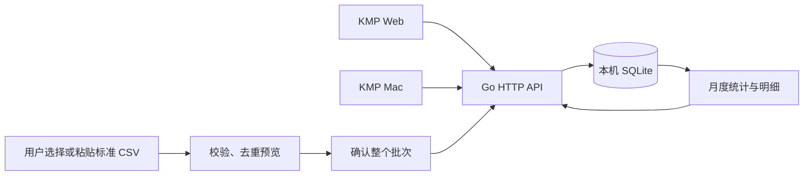

# 本地账本数据链路

更新：2026-09-14。本文描述已实现能力；[完整 MVP 架构提案](mvp-proposal.md) 中的后续模块不代表已经交付。

当前已增加强制 Google / GitHub 登录与白名单；登录配置及新的会话流程见[登录与访问白名单](login-and-access.md)。旧的共享本地访问令牌已移除。

## 当前闭环



Go 同时提供 Web 静态资源和 API。Web 与 Mac 只通过 API 操作数据；只有一个 Go 进程拥有同一账本目录。两个客户端每 5 秒读取一次，支持手动刷新。网络失败明确提示；数据请求失败时标记旧数据，登录状态检查失败或权限撤销时隐藏账本，不回退到合成样本。

KMP 的共享部分是 Compose UI、状态、DTO、Ktor API 访问与金额格式化；JVM 平台提供 CIO 网络引擎、私有连接文件读取及文件选择器，Wasm 平台提供浏览器网络引擎、同源连接发现及文件选择器。

## 启动与数据位置

```sh
./scripts/run-local.sh
# Web: http://127.0.0.1:4173/
# 另一个终端
./gradlew :desktopApp:run
```

服务使用 Go 1.26.8、modernc.org/sqlite 1.58.0；客户端使用 Ktor 3.5.1 与 kotlinx.serialization 1.9.0。启动脚本增量构建 Web 和 Go，把构建缓存放在被忽略的 `.local/` 中。

macOS 默认目录为 `~/Library/Application Support/Monee/`，Linux 为 Go 的用户配置目录下的 `Monee/`。目录权限 0700，数据库与连接文件 0600。SQLite 启用 WAL、外键和事务；数据库不放在应用包或浏览器缓存中。没有数据库级加密或云端副本。

可用环境变量 `MONEE_DATA_DIR` 更改私有目录；Mac 与服务必须使用同一目录。服务也支持 `-data-dir`、`-listen` 和 `-web-dir`。当前只提供 macOS / Linux 的服务锁实现。

使用合成样本时，创建独立测试账本并为测试端口单独配置 OAuth（本段不是免登录入口）：

```sh
MONEE_DATA_DIR="$PWD/.local/test-ledger" ./scripts/run-local.sh -listen 127.0.0.1:4174
# 另一个终端，让 Mac 连接上述同一测试账本
MONEE_DATA_DIR="$PWD/.local/test-ledger" ./gradlew :desktopApp:run
```

两个服务不能占用同一端口，也不能同时拥有同一个数据目录。测试完成后回到默认启动命令即可使用自己的账本；不要把合成测试库复制到正式数据目录。现阶段没有应用内删除或撤销功能。

## 接口与本地访问边界

正式契约见 [OpenAPI](../../api/openapi.yaml)。

| 接口 | 行为 |
| --- | --- |
| `GET /api/v1/health` | API / schema 版本和存活状态，不含账本信息 |
| `GET /api/v1/auth/me` | 当前已验证身份、是否获准和角色；未登录不含身份 |
| `GET /api/v1/dashboard` | 月度统计、月份列表、搜索与每页 50 笔明细 |
| `POST /api/v1/transactions` | 带 Idempotency-Key 创建普通收入或支出 |
| `POST /api/v1/imports/preview` | 保存通过校验的批次与原始 CSV，返回逐行校验/重复情况，不写入正式交易 |
| `POST /api/v1/imports/{id}/commit` | 按预览版本原子入账；重复请求返回同一提交结果 |
| `GET /api/v1/template` | 标准表头；sample=true 返回明确标注的合成样本 |

仅绑定 `127.0.0.1`，固定端口，不提供跨域 CORS。数据接口要求通过 Google / GitHub 验证并存在于白名单。Web 使用 HttpOnly 会话 cookie 和受保护写请求的 CSRF proof；Mac 通过系统浏览器授权后领取绑定到该客户端的一次性会话。会话最长 12 小时，每次数据访问重新检查白名单。

`connection.json` 仅包含本地 baseUrl，不再包含任何数据访问 token。身份、访问名单、会话哈希和审计在独立的 auth.db 中；OAuth 凭据来自私有 auth.json，不进入 Git。原有账单数据库结构不受本次登录接入影响。

初始超管在首次初始化时指定；普通成员不能管理白名单。用户从名单停用后，下一次数据请求返回 403。Host / Origin / Fetch Metadata 继续校验，仅固定 OAuth 回调和顶层导航作必要例外；不能把例外用于数据接口。

未来远程服务器模式还需要 HTTPS、Secure cookie、部署地址与新的客户端配置。当前只支持本机服务，OAuth 不替代操作系统文件权限。

## 金额与统计

- 仅 CNY。输入 `amount` 为正数“元”的十进制字符串，最多两位小数，大于 0 且不超过 100 亿元；不接受科学计数法、千分位或 JSON 数字。
- 数据库为 64 位整数“分”；响应 `amountMinor` 是带符号的“分”字符串，支出负、收入正；汇总 `incomeMinor` / `expenseMinor` 为非负“分”字符串。前端只为图表比例使用浮点，不进行浮点金额计算。
- 日期是 1900–2200 年的 YYYY-MM-DD，账本业务时区 Asia/Shanghai；创建/修改时间保存 UTC。
- 月度统计覆盖该月全部已确认交易，搜索和分页仅影响明细。收入、支出、来源数、总笔数与筛选后笔数明确区分。
- 每笔交易与两条平衡分录在同一事务保存。所有资金账户暂为 clearing / 待核实账户，分类使用费用或收入账户；不声称有可靠的资产或负债余额。

## 标准 CSV 与重复规则

UTF-8，支持 BOM；最大 2 MiB、1000 笔。请求 JSON 最大 3 MiB（转义开销可能先触及请求限制）。必填列为 `date,type,amount,currency,merchant,source`；可选 `category,account,external_id,note`。未知或重复表头拒绝，非法行会使整个批次不能提交，不做部分入账。空分类设为“未分类”，空资金账户设为“待核实资金账户”。`type` 支持 expense/income 或支出/收入。

1. 同一账本中，相同文件内容哈希重试使用同一批次，已提交批次返回原结果。
2. 有来源流水号时，用“来源 + 资金账户 + 外部流水号”识别身份。身份相同且规范化内容一致时跳过；内容不同则报冲突，不覆盖原账单。
3. 没有可靠相同身份时，相同日期、收支类型、金额、币种和商户只标为“疑似重复”，包括跨来源记录。用户勾选确认代表它们是独立交易，随后仍会分别入账。当前没有把跨来源流水合并为同一交易的功能。
4. 提交时校验账本版本，预览期间其他客户端新增交易会导致冲突，要求重新预览。整个批次、来源记录、分录和 change_log 一起提交或回滚。
5. 手动记账要求 16–128 字符的 Idempotency-Key；同 key 同规范化请求返回同一交易，改内容复用 key 返回冲突。客户端编辑表单时更新 key，原请求重试沿用 key。

通过校验的预览保存原始 CSV、内容哈希与解析器版本；确认入账时保存行号、标准化记录及来源到交易的关联。存在解析或身份冲突的批次返回错误，不保存为可提交批次。界面展示来源流水号和备注；完整原文查看、批次历史列表、导出与恢复界面后续实现。

支付宝、微信、招商/农业/上海银行/工商银行及白条的原生 CSV/XLSX/PDF 格式尚未适配。不要把转账、退款、还款强行改成 income/expense 导入；这些会影响统计口径，需要独立业务模型。

## 后续数据兼容性

账本、设备、账户、交易、分录和来源记录使用稳定 UUID。schema 版本 1 存在 SQLite user_version；更新版本数据库会被旧程序拒绝。交易和账户有实体版本、时间及 deleted_at 预留；每次新增业务原子生成带全局 change_id、设备、base/entity version 和 payload version 的 change_log。

上述是迁移与同步的基础，尚未实现编辑/删除 API、变更传输、冲突解决、PostgreSQL 或版本化完整备份恢复。不要把标准 CSV 导入或 SQLite 文件复制称为完整云端同步。新增 schema 迁移前需实现备份与恢复验证。

## 验证记录

2026-09-14，Apple Silicon Mac + JDK 17 + 内置浏览器，仅使用隔离目录中的合成数据。

- Go 的账本及 HTTP 测试通过 race 检查，覆盖精度、重启恢复、分录平衡、幂等并发、重复/冲突/疑似重复、过期预览、事务失败回滚、分页与跨源访问边界。
- 共享 JVM 测试 2 项通过，覆盖金额格式化及超过 JavaScript 安全整数的 JSON 金额字符串；Mac .app 和 Web 生产构建通过。
- Web 通过文件选择器导入 3 笔标准 CSV，再通过表单录入中文商户与 ¥12.34 支出；两端自动显示同样 4 笔，支出 ¥136.84、收入 ¥25,000.00。
- 相同文件预览/提交重试返回原结果，账本仍为 4 笔。
- 重启独立 Go 进程后，4 笔数据、交易/账本 ID、版本与金额逐项一致；浏览器重新发现凭据后继续读取。
- `go vet ./...`、启动脚本语法与实际启动、OpenAPI YAML 解析通过。正式默认账本保持为空，Web 与 Mac 已确认自动切换并显示连接成功。

Mac 文件选择与实际中文输入法、完整屏幕阅读器体验、更多浏览器和大账本性能仍需独立验收。
