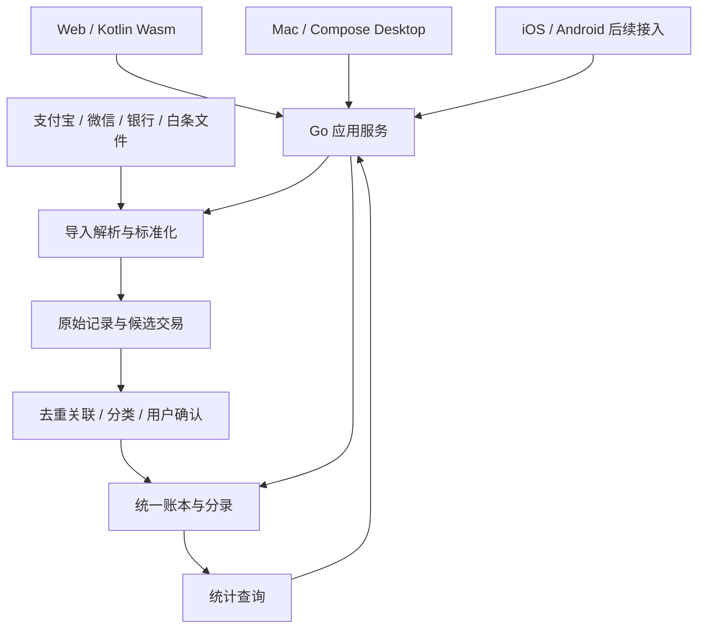

# Monee 产品与代码架构提案

状态：KMP 客户端选型已确定；业务架构为待实施提案。更新：2026-09-14。

对应需求：[MVP 产品讨论稿](../product/mvp-discussion.md)。初始仓库基线 `b3ebbb2` 仅包含 README 和 MIT License；当前已补充品牌资源与设计文档，已开始建立 KMP 体验验证工程，正式账本业务尚未实现。

品牌资源统一保存在 `assets/brand/`，应用图标在各端工程建立后派生；名称与 Slogan 遵循[品牌说明](../brand.md)。

## 已确定的技术栈

2026-09-14 确定客户端采用 **Kotlin Multiplatform（KMP）+ Compose Multiplatform**，共享界面、交互状态、客户端模型和 API 访问。服务端继续采用 **Golang**；首版本地存储采用 **SQLite**，后续云端数据库以 PostgreSQL 为候选。

| 平台 | 实现方式 | 当前阶段 |
| --- | --- | --- |
| Web | Kotlin/Wasm + Compose Multiplatform | 首轮验证入口 |
| Mac App | Kotlin/JVM + Compose Desktop | 首轮验证入口，不使用 WebView 容器 |
| Android | KMP 共享模块 + Compose 平台入口 | 后续补齐 |
| iOS | KMP 共享模块 + Compose / UIKit 入口 | 后续补齐 |

Web 与 Mac 共享 `shared/src/commonMain` 的 UI 和交互逻辑，分别编译为 Wasm 与 JVM 程序。平台专属的文件选择、钥匙串、通知、邮件凭据和后台任务放在平台实现中，不渗入共享界面。

Go 仍是账本、去重、退款、还款与统计口径的唯一生产实现；KMP 负责客户端展示与交互，不重复实现服务端会计规则。降低长期开发成本是此次选型目标，实际收益需通过各端迭代验证。

第一轮使用同一份合成数据验证中文、金额、筛选、详情、图片资源和响应式布局。Compose Web 的浏览器能力、包体与加载性能需实测，平台支持以验证记录为准。

## 整体结构



采用 Go 模块化单体，一个部署单元内分模块。导入任务状态持久化，可由同进程任务执行器处理；MVP 无需独立微服务、消息队列或分析数仓。报表先直接查询确认后的账本，聚合缓存需要时再加。

用户已明确希望减少日常人工观测。因此除账本外增加 insights 模块，消费账本聚合结果和来源覆盖信息，在新账单入账后生成变化解释与合并后的待办。接入通道（文件选择、后续指定目录/邮件）和文件解析器分开，新增渠道不用重写账单解析和去重。

### 自动接收账单

用户已选择邮件附件/指定文件夹优先，手动导出补充。第一条实现选择指定文件夹，随后按实际邮箱服务适配邮件入口。

- 文件夹：只扫描用户明确配置的目录；启动时补扫，运行中监听并定期补扫；文件写入完成并稳定后才接收。记录文件哈希与处理状态，重启、文件重命名和重复事件不会重复入账。保留来源文件，失败条目可重试。
- 邮件：按用户配置的邮箱、账单专用目录/筛选条件增量获取附件。供应商 API 或 IMAP 的选择取决于实际邮箱；凭据存系统钥匙串，不进入 Git 或普通配置文件。保存服务商消息身份及附件哈希；IMAP 实现需正确处理 UIDVALIDITY/UID，不只依靠可能缺失或重复的 Message-ID。
- 两种入口统一生成持久化接收任务，再调用相同格式适配器。加密附件、未知格式和失败任务显示原因，独立重试，不能静默略过。
- 本地服务未运行时不声称持续接收。启动后恢复游标和待处理任务，页面展示最后成功检查、失败原因和账单覆盖。常驻菜单栏/登录启动属于后续明确可配置的桌面行为，不以安装系统常驻服务作为隐含前提。

## 部署和数据库：已确认本地优先

用户已选择本机存储、Web/Mac 共用，后续同步云端并要求兼容性。首版建议采用 Go + SQLite，后续云端以 Go API + PostgreSQL 为候选；云端数据库尚未实施。以下服务器模式只描述后续方向。

| 数据位置 | 可行实现 | 明确边界 |
| --- | --- | --- |
| Mac 本机 | Go 服务 + SQLite；服务提供 Web 静态资源及 API；Mac 壳使用相同服务和数据库路径 | 一个 Go 进程拥有数据库访问；本机浏览器与 Mac App 共用同一个实例，不各自创建一份账本 |
| 用户自有服务器 | Go 服务 + PostgreSQL；Web 和 Mac 通过 HTTPS 使用同一 API | 首版即有单用户登录、会话管理与备份；跨设备在线共享不等于离线自动同步 |

Mac 通过 Compose Desktop 的原生分发打包。Go 服务可作为附带可执行程序，由桌面平台层管理；需要完成单实例锁、发现已有实例、启动失败处理、架构打包、退出生命周期与更新测试。第一轮 UI 验证暂不启动 Go 服务。

本地仅绑定回环地址，API 仍有访问凭据与来源校验；“在本机运行”不等于允许任意网页读取账单。Web 页面由本地 Go 服务同源提供，浏览器访问该地址。Mac JVM 客户端访问同一个服务；启动发现、凭据交接和受信来源应一起实现。数据库放在固定的应用数据目录，不在仓库、浏览器缓存或安装包内。

未来服务端模式不以隐藏 URL 代替登录。首版只实现 SQLite；通过领域模型、迁移和契约保持演进能力，不同时维护两套数据库实现。

### 为云端同步保留的数据契约

1. 账本、账户、交易、来源记录、修订和设备使用客户端可生成的全局稳定 ID，不以数据库自增主键作为外部身份。迁移时 ID 不变，绑定云端身份不重建账本。
2. 持久化金额为 64 位最小货币单位整数，币种为明确代码，API/备份使用十进制字符串表达最小单位；时间戳为 UTC，业务日期及账本时区分别保留。首版人民币约束必须显式校验。
3. 业务数据带账本 ID、实体版本、来源设备与创建/修改时间；删除用可同步的 tombstone。时间戳用于展示和诊断，不单独作为同步顺序或冲突裁决依据。
4. 每次业务事务原子保存数据和 change_log，记录 change_id、device_id、entity_id、base_version、entity_version、操作类型及 payload_version。变更按交易聚合提交，不能只同步部分分录。首次部署即可保留这些字段和变更记录，网络传输后续实现。
5. 云端采用幂等接收和服务端游标；同一 change_id 重传不重复入账。两端基于同一版本编辑同一交易时应显式产生冲突，禁止按设备时间“最后写入覆盖”财务记录。具体协议与冲突 UI 在同步阶段实现并测试。
6. 首次同步带上稳定 ID、删除记录和必要历史，后续传增量。原始附件以内容哈希关联，独立传输并校验；附件未同步时显示可用状态，不能伪装已备份。
7. 数据库迁移单独版本化；SQLite 本地结构、API schema、备份格式各有版本。迁移前备份，未知未来版本拒绝以旧版本覆盖。SQL 方言差异留在存储层，报表口径与账本不变量通过相同用例验证。

版本化全量导出/导入用于备份恢复和初次迁移；它不能替代持续同步。首版验收含恢复后 ID、金额、关联及删除状态保持一致，后续同步阶段再验证跨设备编辑、断网重传与冲突处理。

## 核心数据模型

| 实体 | 责任 |
| --- | --- |
| Ledger | 账本、币种策略、时区和拥有者范围；首版只有一个个人账本 |
| Account | 资产/负债账户及期初余额；支付渠道另外记录 |
| ImportBatch / ImportFile | 导入状态、文件哈希、来源账户、适配器版本、统计计数 |
| RawRecord | 文件中的原始行、行号、原始字段、外部标识、时间和来源；按导入事实保留 |
| Candidate / ReviewItem | 标准化候选、疑似重复、字段缺失、退款匹配等待确认问题 |
| Transaction | 一笔真实业务事件，包含类型、发生日期、记账日期、备注、状态和修订版本 |
| SourceLink | 多条原始记录关联到真实交易，并记录匹配证据、规则或人工决定；不删除另一来源 |
| Posting | 交易影响的账户和分类分录；同币种借贷平衡，变更随交易原子提交 |
| Category / Tag / Rule | 分类、标签和可解释的商户/关键词规则；分类纠正不改写原始记录 |
| Revision | 用户编辑、关联、取消关联、撤销操作的可追溯记录 |
| ChangeLog | 与业务事务原子写入的可同步变更，包含版本和删除语义；首版记录，后续传输 |

金额用最小货币单位整数存储（人民币为分），解析及运算禁止使用二进制浮点。API 明确金额与币种表达方式；若用最小单位字符串，可避免 JavaScript 大整数丢精度。交易发生时间、银行入账时间分别保存，报表按账本时区切分日期。

底层建议使用平衡分录，界面保持普通记账操作。资产、负债、收入、费用、期初权益和待核实账户具有明确类型；不确定资金来源可用明确标注的待核实账户，但不会被展示成已确认真实余额。

例子：

- 用银行卡经支付宝消费 100 元：借费用 100，贷银行卡 100；支付宝仅作渠道与原始来源。
- 白条消费 1,000 元：借费用 1,000，贷白条负债 1,000。
- 用银行还白条本金 1,000 元并支付手续费 10 元：借白条负债 1,000、借手续费 10，贷银行卡 1,010；本次仅 10 元计入费用。
- 原消费退款 20 元回银行卡：借银行卡 20，贷原费用分类 20，关联原交易。

## 导入与去重

处理链：受限大小的文件 → 识别格式/编码/表头 → 来源适配器 → 标准化候选 → 校验与关联建议 → 预览 → 明确提交 → 同事务写入账本及来源关系。

1. 同文件重传：以账本、来源账户、文件内容哈希识别已处理批次，重试不再次入账。
2. 同来源重复记录：可验证的外部记录标识优先，作用域包含平台账户和事件类型。退款、状态更新与原付款需分别建模，不能仅按订单号丢弃。
3. 无稳定标识的重复记录：规范化字段指纹只生成疑似重复；同一人可能有时间、金额、商户完全相同的两笔真实交易，不静默删除。
4. 跨来源重复：金额、时间、商户、资金账户、订单号等形成匹配证据，默认人工确认。原始行全部保留，只建立到同一笔交易的关系。
5. 草稿转正式：通知或手工捕获与后续账单建立关系，既不重记，也不无声覆盖用户分类。
6. 并发提交及重试：唯一约束、幂等键、事务和状态版本共同保证不会重复入账。
7. 解析未知类型、失败/关闭状态、非人民币或金额异常时进入明确待确认/失败状态，不当作普通支出。

自动化模式只针对用户配置且格式验证通过的来源：第一次预览确认，后续可自动提交确定的候选，并报告新增、重复跳过、待确认与失败计数。单纯分类未知不会阻塞确定交易入账；跨来源关联缺乏可靠证据时仍需集中确认。后台入口复用同一提交服务，不绕过幂等性、鉴权和账本校验。

### 洞察的数据契约

洞察保存规则 ID/版本、分析时段、来源覆盖、证据交易 ID、比较基线和生成所基于的账本版本。相同内容以稳定标识更新，避免重复提醒。修改或撤销交易后重算受影响洞察，旧解释不能继续指向已失效金额。月中与完整月份不直接比较，无法建立可比来源和日期范围时显示数据不足。

变化解释以可重复的聚合和文字模板开始。疑似固定支出与疑似重复扣款是待核实提示，不自动作为事实入账、删除流水或建议金融交易。

撤销批次只撤销其独立产生且未被后续操作依赖的入账。交易若已有其他导入来源、人工修订或退款关联，先展示影响并要求处理冲突，不能简单批量删除。撤销后报表与余额一致，原始记录及操作历史可追溯。

## 建议目录

```text
shared/                   # KMP：共享 Compose UI、客户端模型、状态和 API 访问
  src/commonMain/
  src/commonTest/
  src/jvmMain/            # 按需补充桌面平台能力
  src/wasmJsMain/         # 按需补充浏览器平台能力
desktopApp/              # Compose Desktop / macOS 入口与打包
webApp/                  # Kotlin/Wasm 浏览器入口
androidApp/              # 移动阶段建立
iosApp/                  # 移动阶段建立
server/
  cmd/monee/              # 服务入口
  internal/
    ledger/               # 交易、分录与账户不变量
    ingestion/            # 批次、预览、确认、来源适配器
    intake/               # 文件夹/邮件接收、任务、增量游标及重试
    reconciliation/       # 原始记录与交易关联、重复审查
    categorization/       # 分类规则及人工修订
    reporting/            # 统一统计口径
    insights/             # 变化归因、数据覆盖和集中待处理摘要
    transport/http/       # API、鉴权、错误和请求校验
    storage/              # 选定数据库实现、事务与迁移
  migrations/
api/
  openapi.yaml
fixtures/
  synthetic/              # 合成与彻底脱敏的解析样本
docs/
  product/
  architecture/
```

移动端在正式开工时建立目录，当前不创建空工程。模块边界由职责确定，不为每张表建立一层服务。Go 是账本规则的唯一实现；前端只做交互校验和展示。

## API 草案

- `POST /api/v1/imports`：创建批次并接收文件，返回批次与解析状态。
- `GET /api/v1/imports/{id}`：预览结果、计数、来源行和校验问题。
- `POST /api/v1/imports/{id}/commit`：带预览版本及幂等键提交选定候选；提交前重新检查重复。
- `POST /api/v1/imports/{id}/revert`：预览/执行批次撤销，遇到依赖关系返回冲突。
- `GET/POST /api/v1/transactions`：分页查询与新增交易。
- `PATCH /api/v1/transactions/{id}`：带版本更新交易及分录，冲突时不覆盖。
- `POST /api/v1/transactions/{id}/void`：可追溯撤销交易。
- `GET/POST /api/v1/accounts`：账户与期初余额设置。
- `GET /api/v1/reports/monthly`、`GET /api/v1/reports/categories`：统一账本上的统计。
- `GET /api/v1/insights`：返回有来源覆盖、可比时段和交易证据的变化解释及待处理摘要。

确定实现范围后补充正式 OpenAPI：错误模型、分页、时间范围、金额编码、导入确认规则及鉴权，而不是将上述列表当成已可调用接口。

## 验证重点

- 核心交易：分录平衡、精度、转账、还款本金/利息拆分、部分及跨月退款。
- 解析：每种实际支持的文件格式都有脱敏样本；表头说明行、编码、长交易号、空值、状态变更都有明确行为。
- 导入：同文件重试、重叠时间段、并发提交、来源合并、退款共用订单号及撤销后的统计一致性。
- 一次端到端闭环：导入 → 待确认 → 入账 → 查报表 → 手动补记 → 重启仍存在 → 备份 → 恢复验证。
- Mac/Web：读取同一账本，文件选择和中文输入可用，不因各自启动服务而出现两份账本。

真实账单与数据库不进入 Git。日志避免记录原始账单行，备份文件及源文件按选定数据位置保存。第一版分析采用可解释规则及确定性统计；外部 AI 不是必需依赖。备份恢复包含原始来源、分类规则与修订历史，并校验版本和完整性；普通 CSV 导出不能冒充完整备份。

## 选型资料

- [KMP 官方项目结构](https://kotlinlang.org/docs/multiplatform/compose-multiplatform-create-first-app.html)：共享模块与各端入口。
- [Compose 兼容性](https://kotlinlang.org/docs/multiplatform/compose-compatibility-and-versioning.html)：编译器、JDK 和平台要求。
- [Kotlin 官方平台稳定性](https://kotlinlang.org/docs/multiplatform/supported-platforms.html)：KMP 核心与 Compose UI 稳定性分别判断；当前页面列出 Compose Web 为 Beta。

以上为 2026-09-14 查询结果。实现时锁定依赖版本；平台集成能力以目标系统与实际设备验证为准。
